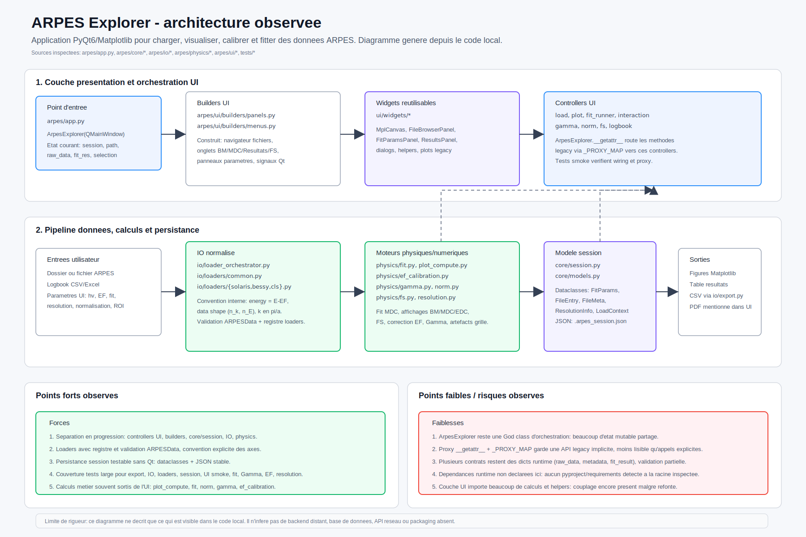
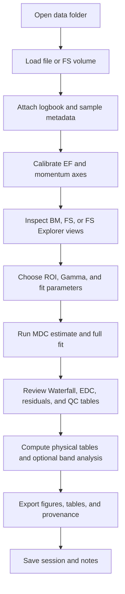

# ARPES Explorer

Desktop application for ARPES visualization, calibration, fitting, and data-analysis workflows.

[](https://github.com/mickaelspecht-boop/Arpes_Python/actions/workflows/build.yml)


## Summary

ARPES Explorer is a PyQt6 desktop application for angle-resolved photoemission spectroscopy data. It is intended for loading experimental files, attaching logbook metadata, inspecting band maps and Fermi-surface volumes, applying energy and momentum calibrations, fitting MDCs, and exporting figures or tables.

Many ARPES file formats do not store all metadata required for analysis. Photon energy, temperature, polarization, cut direction, manipulator angles, lattice constants, and work function may be provided by a separate logbook, commonly as an `.xlsx` file.

The codebase separates numerical routines from the Qt interface so that loaders, physics helpers, and result calculations can be tested without a graphical backend. Beamline-specific loaders and advanced analysis modules should be validated on the relevant datasets before use in quantitative work.

## Scope

ARPES datasets are sensitive to metadata and calibration choices. The same intensity map can lead to different physical axes or interpretations if the photon energy, sample geometry, work function, lattice constants, or cut direction are wrong. The application therefore keeps measurement files, logbook rows, sample metadata, calibration parameters, fit settings, and exported results in the same session.

Typical operations include:

- inspect band maps and Fermi-surface volumes;
- keep file, logbook, and sample metadata together;
- fit MDC peak pairs and review slice-level diagnostics;
- compare fitted dispersions with optional DFT references;
- export tables, figures, and provenance records.

## Features

### Existing

- PyQt6 desktop interface with tabs for BM, FS, FS Explorer, KZ, Results, MDC Fit, Notes, Help, and Start.
- Session persistence through `.arpes_session.json`, including loaded files, sample metadata, EF offsets, fit parameters, fit zones, notes, annotations, and results.
- Loader registry with strict `ARPESData` validation and a common internal convention:
  - `data` as `(n_k, n_E)`;
  - energy axis as `E - EF` in eV;
  - FS volumes as `(n_ky, n_kx, n_E)`;
  - momentum axes in `pi/a` when calibrated.
- Supported experimental loaders:
  - Solaris/DA30 via optional `erlab`: `.ibw`, `.pxt`, `.zip`;
  - BESSY Scienta/SES R8000 Igor Binary Wave v5: `.ibw`;
  - CLS/LNLS text: individual BM files with `*_param.txt`, or FS folders with `*_Cycle_*_Step_*.txt`;
  - ALLS SpecsLab Prodigy Igor Text exports: `.itx`.
- Logbook import from `.xlsx`, `.xls`, `.csv`, and `.tsv`, with automatic column detection for filenames, photon energy, temperature, polarization, direction, manipulator angles, sample formula, Materials Project ID, lattice constants, and work function.
- Scoped Excel logbooks: one workbook can contain one sheet per measurement folder when each sheet declares a `Folder Name`.
- Browse-only mode for incomplete metadata, keeping raw axes instead of forcing a momentum calibration.
- Band-map display modes: Raw, EDC normalization, second derivative, curvature.
- EF calibration tools, Gamma centering, BM/FS pairing, distortion preview/correction, and FFT grid-artifact display filtering.
- MDC fitting with Lorentzian peak pairs, fit zones, waterfall diagnostics, point deletion/undo/redo, annotations, and batch fitting.
- Results tab with kF dispersion, Gamma(E), slice diagnostics, physical result tables, bootstrap uncertainty option, multi-file analysis, and figure/table export.
- Fermi-surface tools: BZ overlays, compatible BM cut overlays, pocket measurements, FS map export.
- FS Explorer for calibrated FS volumes: interactive iso-energy map, draggable cut line, extracted BM, angle/energy sweep.
- KZ maps for variable-photon-energy BM series, including raw `k//` vs `hv` and converted `k//` vs `kz` views.
- Band Analysis tools for TB fits, kink/self-energy analysis, and gap-oriented analysis.
- Optional theory overlay support:
  - local DFT imports from YAML/JSON, VASP `vasprun.xml`, and QE-style `.dat`/`.txt`;
  - optional Materials Project lookup/cache when the relevant API dependency and credentials are available.
- Export of per-slice results, physical summaries, provenance sidecars, CSV/TXT/LaTeX tables, and figures.
- PyInstaller build recipe and GitHub Actions workflow for tests and tagged release artifacts.

### Experimental or Limited

- Solaris/DA30 support depends on optional `erlab`; it is excluded from bundled PyInstaller binaries.
- ALLS 3D ITX data keeps the third axis as a raw scan coordinate unless later calibrated; geometry confidence is intentionally low.
- Resolution correction quality depends on analyzer metadata. Defaults and manual values should be treated as assumptions, not measured instrument functions.
- Materials Project support is optional and network/API dependent.
- KZ conversion uses a free-electron final-state model and depends on reliable photon energy, work function, lattice `c`, and inner potential `V0`.

## Architecture Overview



## Installation

This repository is currently source-run and PyInstaller-packaged. It does not yet provide a `pyproject.toml`, `setup.py`, Conda environment file, or published package.

### From Source

```bash
git clone https://github.com/mickaelspecht-boop/Arpes_Python.git
cd Arpes_Python

python3.12 -m venv .venv
source .venv/bin/activate
python -m pip install --upgrade pip
python -m pip install -r requirements.txt pytest
```

On Linux, Qt may also need system libraries:

```bash
sudo apt-get update
sudo apt-get install -y libegl1 libgl1 libxkbcommon-x11-0
```

### Optional Dependencies

- `erlab` is needed for the Solaris/DA30 source loader. It is optional and not bundled in the PyInstaller binaries.
- Materials Project features require the relevant `mp-api` stack and an API key.

## Quick Start

Launch the GUI:

```bash
python arpes_explorer.py
```

Recommended first workflow:

1. Open a measurement folder from the left browser.
2. Fill Sample setup with work function, lattice constants, and cut direction when known.
3. Attach a global or scoped logbook if metadata is not fully stored in the files.
4. Load a BM or FS file.
5. Check EF and Gamma before fitting.
6. Define an MDC fit window, run a single-slice estimate, then run the full fit.
7. Inspect Waterfall, EDC, Results, and Notes before exporting.

Build a local executable:

```bash
python -m pip install pyinstaller
pyinstaller arpes.spec --noconfirm
```

Release builds are produced by GitHub Actions on `v*` tags. See [docs/BUILD_EXECUTABLE.md](docs/BUILD_EXECUTABLE.md).

## Data-Analysis Workflow



For reproducibility, raw data should be loaded with the logbook row that describes the scan. Calibration choices, sample constants, fit windows, rejected points, notes, and export settings are stored in the session.

## Logbook and XLSX Blueprints

ARPES Explorer can load files without a logbook when the file metadata is sufficient. When metadata is incomplete, a logbook is used to provide photon energy, sample temperature, polarization, cut direction, manipulator angles, lattice constants, and work function. These values can affect momentum conversion, KZ conversion, BM/FS pairing, and comparison between scans.

Two Excel blueprints are provided:

- [docs/examples/arpes_logbook_blueprint_simple.xlsx](docs/examples/arpes_logbook_blueprint_simple.xlsx) — one sheet for a single data folder.
- [docs/examples/arpes_logbook_blueprint_scoped.xlsx](docs/examples/arpes_logbook_blueprint_scoped.xlsx) — one workbook with several sheets, each sheet attached to a subfolder through `Folder Name`.

Minimum required columns:

| Column | Required | Meaning |
|---|---:|---|
| `File` | yes | Filename, scan number, or recognizable file token. Examples: `scan_0001.ibw`, `9`, `FS3`. |
| `hv` | yes | Photon energy in eV. |
| `Temp` | no | Sample temperature in K. |
| `Pol` | no | Polarization such as `LH`, `LV`, `RC`, `LC`, `s`, or `p`. |
| `Direction` | no | Cut direction such as `G-M`, `Gamma-X`, or `Γ-Σ`; labels are normalized by the app. |
| `Azi`, `Polar`, `Tilt` | no | Manipulator angles in degrees when available. |
| `Formula`, `MP-ID` | no | Sample formula and optional Materials Project identifier. |
| `a`, `b`, `c` | no | Lattice constants in angstrom. |
| `Work Function` | no | Work function in eV. |

Common aliases are accepted (`Filename`, `Photon Energy`, `Sample Temperature`, `Light Polarization`, `High symmetry path`, etc.). The column names in the blueprints are the recommended names. Empty cells in `Direction`, `Pol`, and `Azi` inherit the previous non-empty value.

For scoped workbooks, put `Folder Name` in the first rows of each sheet and the folder value in the cell to its right. The value should match the data subfolder name, for example `BNA_S1` or `data/BNA_S1`. The table header can start below that metadata block.

## Architecture

Simplified tree:

```text
.
├── arpes_explorer.py
├── arpes_plots.py
├── arpes.spec
├── requirements.txt
├── arpes/
│   ├── app.py               # PyQt6 main window and controller wiring
│   ├── analysis/            # result aggregation, bootstrap, self-energy
│   ├── core/                # session dataclasses, sample config, undo
│   ├── io/                  # loaders, logbooks, export, cache, KZ datasets
│   ├── physics/             # NumPy/SciPy calculations, no Qt dependency
│   ├── theory/              # DFT import, Materials Project, overlays
│   └── ui/                  # widgets, builders, controllers
├── arpes/docs/              # in-app Help Markdown
├── docs/                    # project documentation and architecture diagram
├── tests/                   # pytest suite
└── tools/                   # maintenance/audit scripts
```

Design constraints used in the codebase:

- keep PyQt imports out of `arpes/physics` and `arpes/io`;
- keep loader outputs validated through the shared `ARPESData` convention;
- keep shared fit-result writes routed through `arpes/core/fit_result_store.py`;
- prefer small controllers with one responsibility.

Main Python entry points:

| File or package | What it does |
|---|---|
| `arpes_explorer.py` | Starts the desktop application. It stays intentionally tiny and delegates to `arpes.app`. |
| `arpes_plots.py` | Compatibility module for older imports that still expect plotting helpers at the repository root. |
| `arpes/app.py` | Builds the main PyQt6 window and wires controllers, widgets, menus, and session state together. |
| `arpes/core/*.py` | Defines durable data structures: sessions, file entries, sample metadata, fit-result storage, and undo support. |
| `arpes/io/*.py` | Reads experimental files and logbooks, matches metadata to files, exports results, and manages cached artifacts. |
| `arpes/io/loaders/*.py` | Contains one loader per supported data source or beamline format. |
| `arpes/physics/*.py` | Runs numerical ARPES calculations with NumPy/SciPy and no Qt dependency. |
| `arpes/analysis/*.py` | Turns fit outputs into physical summaries, aggregations, bootstrap estimates, and self-energy helpers. |
| `arpes/theory/*.py` | Imports and aligns theory/DFT references used for comparison overlays. |
| `arpes/ui/builders/*.py` | Assembles menus and panels from smaller widgets. |
| `arpes/ui/controllers/*.py` | Handles user actions and coordinates between the GUI and the pure computation modules. |
| `arpes/ui/widgets/*.py` | Defines reusable PyQt widgets, dialogs, plots, and parameter panels. |
| `tools/*.py` | Contains local maintenance scripts, currently for auditing metadata on real data folders. |

## Data Formats

Confirmed by the loader registry:

| Source | Format | Notes |
|---|---|---|
| Solaris/DA30 | `.ibw`, `.pxt`, `.zip` | Uses optional `erlab`; not bundled in binaries. |
| BESSY Scienta/SES R8000 | Igor Binary Wave v5 `.ibw` | Requires SES/R8000 metadata. |
| CLS/LNLS | Text BM + `*_param.txt`; FS folders with `*_Cycle_*_Step_*.txt` | Photon energy is required. |
| ALLS SpecsLab Prodigy | Igor Text `.itx` | 2D BM and 3D FS-like volumes; 3D scan geometry may need manual calibration. |
| KZ series | variable-`hv` BM series | Loaded through existing BM loaders and KZ dataset code. |

Unsupported formats should fail explicitly through the loader dispatcher. Support for HDF5, NeXus, generic Scienta exports, or arbitrary CSV is not claimed unless a loader is added and tested.

## Examples

Run tests:

```bash
python -m pytest tests/ \
  --ignore=tests/test_annotations.py \
  --ignore=tests/test_local_dft_loaders.py -q
```

Run Help-panel tests only:

```bash
python -m pytest tests/test_help_panel.py -q
```

Audit real-data metadata locally:

```bash
python tools/audit_real_data_metadata.py /path/to/data
```

No notebooks or public demo datasets are currently committed.

## Tests and Quality

The CI workflow runs on pushes to `main`, pull requests, `v*` tags, and manual dispatch. It installs `requirements.txt`, adds Qt runtime libraries on Linux, sets `QT_QPA_PLATFORM=offscreen`, and runs:

```bash
python -m pytest tests/ \
  --ignore=tests/test_annotations.py \
  --ignore=tests/test_local_dft_loaders.py -q
```

Known local-test notes:

- `tests/test_annotations.py` and `tests/test_local_dft_loaders.py` are intentionally ignored by the standard command.
- UI tests require PyQt6 and a working Qt platform backend. Use `QT_QPA_PLATFORM=offscreen` for headless Linux runs.
- There is no configured formatter, linter, or type checker in the repository yet.

## Known Limits

- ARPES interpretation depends on experimental geometry, metadata quality, EF calibration, work function, lattice constants, and axis conventions.
- Momentum conversion and KZ conversion should not be treated as automatically correct when metadata is incomplete.
- DFT overlays are references for comparison and alignment, not experimental calibration.
- Publication-quality use requires checking raw data, fit residuals, calibration sources, and exported provenance.
- The project is distributed under Apache-2.0. Check third-party dependencies separately when redistributing binaries.

## Contribution

See [CONTRIBUTING.md](CONTRIBUTING.md).

Short version:

```bash
python3.12 -m venv .venv
source .venv/bin/activate
python -m pip install --upgrade pip
python -m pip install -r requirements.txt pytest
python -m pytest tests/ --ignore=tests/test_annotations.py --ignore=tests/test_local_dft_loaders.py -q
```

When contributing scientific features, include tests with synthetic or shareable data. Do not commit private beamtime data, API keys, local absolute paths, or large generated artifacts.

## Citation

This is scientific software. If you use it in analysis that leads to a report, thesis, preprint, or publication, cite the repository and the version or commit used. A machine-readable citation file is provided in [CITATION.cff](CITATION.cff).

## License

Apache License 2.0. See [LICENSE](LICENSE).

## Scientific Background

ARPES measures energy- and momentum-resolved photoemission intensity. Common analysis steps include energy referencing to EF, momentum-axis calibration from geometry and lattice constants, MDC/EDC inspection, peak fitting, linewidth analysis, Fermi-surface mapping, and comparison with calculated band structures. ARPES Explorer implements tools for these steps, but physical conclusions still depend on the sample, beamline geometry, calibration quality, and analyst judgment.
