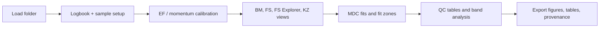

# ARPES Explorer

Desktop software for ARPES visualization, calibration, fitting, and reproducible data analysis.

[README](../README.md) · [Build executables](BUILD_EXECUTABLE.md) · [Issues](https://github.com/mickaelspecht-boop/Arpes_Python/issues) · [Releases](https://github.com/mickaelspecht-boop/Arpes_Python/releases)

## What It Does

ARPES Explorer helps inspect and analyze angle-resolved photoemission spectroscopy datasets from supported beamline formats. It combines a PyQt6 GUI, metadata-aware loaders, calibrated BM/FS views, MDC fitting, KZ maps, DFT overlays, result tables, and export provenance.

## For Whom

- ARPES users checking band maps, Fermi surfaces, and fit quality.
- Condensed-matter students learning a practical ARPES workflow.
- Developers adding loaders, tests, or analysis modules.
- Collaborators reviewing how results were produced.

## Data-Analysis Workflow



## Supported Data

Current loaders cover Solaris/DA30 via optional `erlab`, BESSY Scienta/SES R8000 IBW v5, CLS/LNLS text data, and ALLS SpecsLab Prodigy ITX exports. Other formats should be added through the loader registry and tested with shareable fixtures.

## Installation

```bash
git clone https://github.com/mickaelspecht-boop/Arpes_Python.git
cd Arpes_Python
python3.12 -m venv .venv
source .venv/bin/activate
python -m pip install -r requirements.txt pytest
python arpes_explorer.py
```

Linux headless tests may need:

```bash
sudo apt-get install -y libegl1 libgl1 libxkbcommon-x11-0
QT_QPA_PLATFORM=offscreen python -m pytest tests/ --ignore=tests/test_annotations.py --ignore=tests/test_local_dft_loaders.py -q
```

## Examples

- Open a folder, attach logbook metadata, and load a BM file.
- Calibrate EF from an Au reference and verify Gamma centering.
- Run a single-slice MDC estimate, then a full fit.
- Inspect Waterfall, EDC, residuals, physical tables, and export provenance.

No public screenshots or demo datasets are committed yet.

## Roadmap

- Public screenshots and a small shareable tutorial dataset.
- More documented loader assumptions and sample metadata examples.
- Optional packaging metadata for source installation.
- License selection by the project owner.

## Notes

The README is the main documentation. This page is a compact GitHub Pages entry point and should stay shorter than the README.
